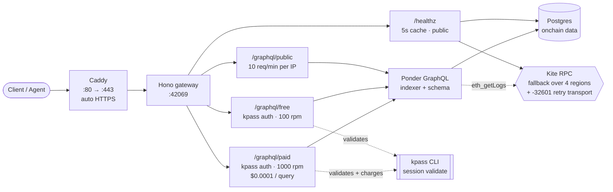

# KiteIndex

**The open-source indexer for Kite Mainnet.**

KiteIndex provides a fast, reliable GraphQL API for querying on-chain activity on Kite — USDC.e transfers, Lucid bridge events, staking, and more. Free public tier; paid tier authenticated via Kite Agent Passport.

> Status: v0.1 in development. Indexer, gateway, and `/healthz` live locally. Deploy planned for Day 8 of the build. Repo is open from day one.
> Live URL: https://kiteindex.xyz (coming soon)

## Why this exists

Kite Mainnet launched April 30, 2026. As of day 4, no public indexer or subgraph exists. Every agent service that needs historical chain data has to either run its own indexer or query RPCs directly. KiteIndex fills that gap.

## What you get

- GraphQL API for Kite Mainnet on-chain data
- USDC.e transfers, bridge events, staking events (v0.1)
- Free public tier — no auth, rate-limited
- Paid tier — kpass session auth, higher rate limits, pay-per-query
- `/healthz` JSON endpoint — chain lag, row counts, kpass binary status, last error
- Open source. Self-hostable. Subgraph-compatible schema where possible.

## Architecture



The four Kite RPC endpoints are tried in measured success-rate order (Virginia → Ireland → Tokyo → Global). `eth_getLogs` lands on backends that don't support it ~40% of the time; the retry transport masks `-32601` with up to 50 attempts per endpoint.

## Sample GraphQL queries

Run these against the public tier locally — `curl http://localhost:42069/graphql/public` after `npx ponder dev`.

**Latest 5 USDC.e transfers**
```graphql
{
  transferEvents(orderBy: "blockNumber", orderDirection: "desc", limit: 5) {
    items { from to value blockNumber txHash }
  }
}
```

**Bridge transfers fully delivered, most recent first**
```graphql
{
  bridgeTransfers(
    where: { status: "executed" }
    orderBy: "executedBlock"
    orderDirection: "desc"
    limit: 20
  ) {
    items { transferId direction sender recipient amount executedBlock }
  }
}
```

**Top 10 validators by stake**
```graphql
{
  validatorRegistrations(orderBy: "stakeAmount", orderDirection: "desc", limit: 10) {
    items { validationId owner stakeAmount delegationFeeBips minStakeDuration }
  }
}
```

## Local dev

```sh
cd indexer
npm install
KITEINDEX_FAKE_KPASS=1 npx ponder dev
```

The `KITEINDEX_FAKE_KPASS=1` flag lets the gateway treat any `X-Kite-Session: dev_*` header as a valid session with a $1 budget — handy for testing `/graphql/free` and `/graphql/paid` without a real Kite Passport. The flag crashes the indexer on startup if `NODE_ENV=production`, so it can never accidentally ship.

`/healthz` returns rich JSON; `/health` is Ponder's built-in `200 ""` for Docker liveness.

## Deploy

See [deploy/README.md](./deploy/README.md) for the single-VPS Docker Compose setup (Caddy + Ponder + Postgres on Hetzner CPX21).

## Roadmap

See [ROADMAP.md](./ROADMAP.md). Targeting public v0.1 within 8 days of project start.

## Context

See [CONTEXT.md](./CONTEXT.md) for verified facts and design decisions that should not be undone.

## Contributing

Issues and PRs welcome at [github.com/gnanam1990/kiteindex](https://github.com/gnanam1990/kiteindex).

## Built by

[@gnanam1990](https://github.com/gnanam1990) — also maintainer of [PolyAgent](https://github.com/gnanam1990/polyagent), the first Polymarket signal service on Kite.

## License

MIT.
